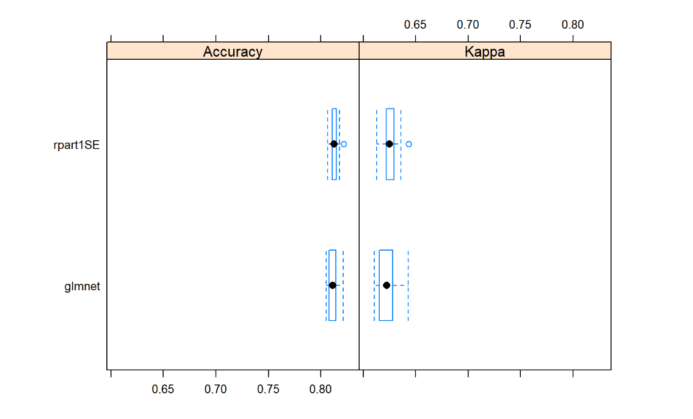
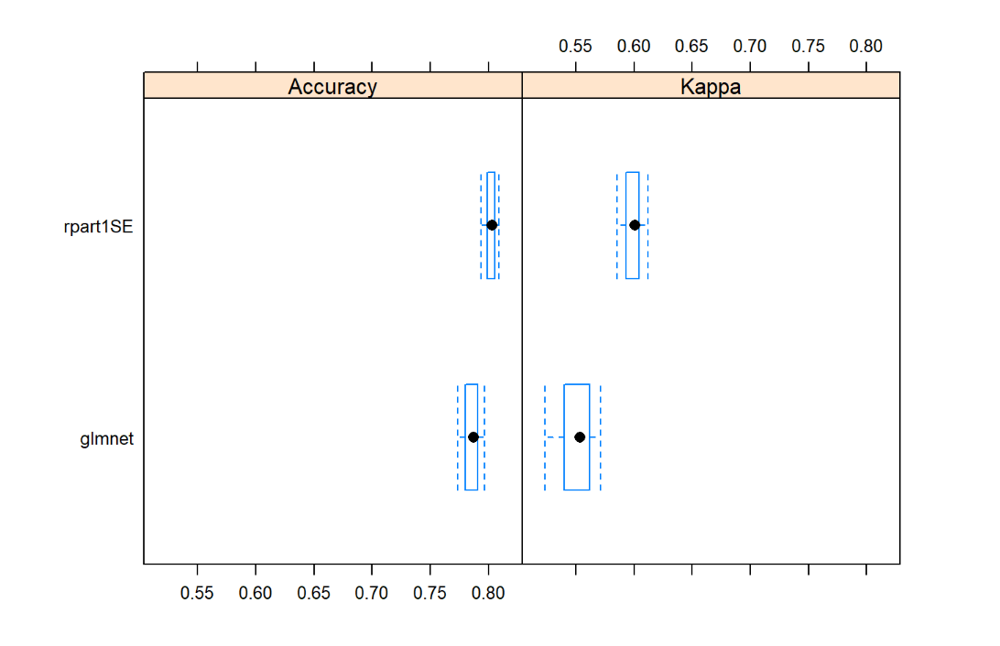

<style>

.remark-slide-content {
  background-color: #FFFFFF;
  border-top: 80px solid #F9C389;
  font-size: 17px;
  font-weight: 300;
  line-height: 1.5;
  padding: 1em 2em 1em 2em
}

.inverse {
  background-color: #696767;
  border-top: 80px solid #696767;
  text-shadow: none;
  background-image: url(https://github.com/goodekat/presentations/blob/master/2019-isugg-gganimate-spooky/figures/spider.png?raw=true);
	background-position: 50% 75%;
  background-size: 150px;
}

.your-turn{
  background-color: #8C7E95;
  border-top: 80px solid #F9C389;
  text-shadow: none;
  background-image: url(https://github.com/goodekat/presentations/blob/master/2019-isugg-gganimate-spooky/figures/spider.png?raw=true);
	background-position: 95% 90%;
  background-size: 75px;
}

.title-slide {
  background-color: #F9C389;
  border-top: 80px solid #F9C389;
  background-image: none;
}

.title-slide > h1  {
  color: #111111;
  font-size: 40px;
  text-shadow: none;
  font-weight: 400;
  text-align: left;
  margin-left: 15px;
  padding-top: 80px;
}
.title-slide > h2  {
  margin-top: -25px;
  padding-bottom: -20px;
  color: #111111;
  text-shadow: none;
  font-weight: 300;
  font-size: 35px;
  text-align: left;
  margin-left: 15px;
}
.title-slide > h3  {
  color: #111111;
  text-shadow: none;
  font-weight: 300;
  font-size: 25px;
  text-align: left;
  margin-left: 15px;
  margin-bottom: -30px;
}

```{r, include=FALSE}

knitr::opts_chunk$set(echo = TRUE,
                      
                      fig.width = 10,
                      fig.height = 5,
                      fig.align = "center",
                      message = FALSE,
                      warning = FALSE)

library(haven)
library(tidyverse)
library(gganimate)
library(dplyr)
library(knitr)
library(ggplot2)
library(lubridate)
df <- read_sas('C:/Users/student/OneDrive - Bryant University/Documents/R/Math421/hdd0318cy.sas7bdat')

df$season <- case_when(df$moa>=3 & df$moa < 6 ~ 'Spring', df$moa >= 6 & df$moa <9 ~'Summer', df$moa>= 9 & df$moa <12~  'Fall', TRUE ~ 'Winter')

df$sex <- case_when(
    df$sex==1 ~ 'Male',
    df$sex==2 ~ 'Female',
    TRUE ~ 'Unknown'
  )

df$provider <- case_when(
  df$provider == 7201 ~ 'Newport',
  df$provider == 7202 ~ 'St. Joseph',
  df$provider == 7203 ~ 'Memorial',
  df$provider == 7204 ~ 'Miriam',
  df$provider == 7205 ~ 'Rhode Island Hospital',
  df$provider == 7206 ~ 'Roger Williams',
  df$provider == 7209 ~ 'South County',
  df$provider == 7210 ~ 'Kent County',
  df$provider == 7211 ~ 'Westerly',
  df$provider == 7212 ~ 'Rehab of RI',
  df$provider == 7213 ~ 'Landmark Medical Center',
  df$provider == 7214 ~ 'Women and Infants',
  df$provider == 7215 ~ 'Bradley',
  TRUE ~ 'Butler'
)


df$campus <- case_when(
  df$campus == 0 ~ 'Hospital Has Only One Premise',
  df$campus == 1 ~ 'St. Joseph Health Services of Rhode Island - Our Lady of Fatima Hospital',
  df$campus == 2 ~ 'St. Joseph Health Services of Rhode Island - St. Joseph Hospital for Specialty Care',
  df$campus == 3 ~ 'Rhode Island Hospital - Adult',
  TRUE ~ 'Rhode Island Hospital - Hasbro'
)

df$raceethn <- case_when(
    df$raceethn==1 ~ 'White',
    df$raceethn==2 ~ 'Black',
    df$raceethn==3 ~ 'Asian',
    df$raceethn==4 ~ 'American Indian',
    df$raceethn==5 ~ 'Native Hawaiian',
    df$raceethn==6 ~ 'Other',
    df$raceethn==7 ~ 'Hispanic',
    TRUE ~ 'Unknown'
  )

df$admtype <- case_when(
    df$admtype==1 ~ 'Emergency',
    df$admtype==2 ~ 'Urgent',
    df$admtype==3 ~ 'Electric',
    df$admtype==4 ~ 'Newborn',
    df$admtype==5 ~ 'Court Committal',
    TRUE ~ 'Unknown'
  )
        
df$payer <- case_when(
    df$payer==0 ~ 'Medicare',
    df$payer==1 ~ 'Medicaid',
    df$payer==4 ~ 'Workers Comp',
    df$payer==5 ~ 'Blue Cross',
    df$payer==6 ~ 'Commercial Ins',
    df$payer==7 ~ 'Self Pay',
    TRUE ~ 'Unknown'
  )

df$dispub92 <- case_when(
    df$dispub92==01 ~ 'Self Care',
    df$dispub92==02 ~ 'Short Term Hosp',
    df$dispub92==03 ~ 'Nursing Fac',
    df$dispub92==04 ~ 'ICF',
    TRUE ~ 'Unknown'
)
```


</style>
---
#Graph 1

.left-code[
```{r plot1, eval=FALSE}

df %>% 
  ggplot()+
  geom_boxplot(mapping = aes(x = age, y = payer))+
  labs(x='Age',y='Payer',
       title='Age Distributions Based on Payer',
       caption='Box plot summarizing distribution for patient age for each payer.')

```
]
.right-plot[
```{r, ref.label = "plot1", echo = FALSE, fig.height = 6, fig.width = 7}
```
]

---
#Graph 2

.left-code[
```{r plot2, eval=FALSE}

df %>% 
  group_by(raceethn, sex) %>% 
  summarise(average_age=mean(age, na.rm=TRUE)) %>% 
  ggplot()+ geom_col(mapping=aes(x=raceethn, y=average_age), 
           position = 'dodge')+ labs(x='Race', y = 'Average Age', 
       title = 'Average Age of Patient by Race', caption = 'White patients have a significantly higher average age when compared to other races.')

```
]
.right-plot[
```{r, ref.label = "plot2", echo = FALSE, fig.height = 6, fig.width = 7}
```
]

---
#Graph 3

.left-code[
```{r plot3, eval=FALSE}
df %>% 
  ggplot()+
  geom_boxplot(mapping = aes(x = age, y = admtype))+
  labs(x='Age', y='Type of Admission',
       title='Age Distributions Based on Type of Admission',
       caption='Box plot summarizing distribution  
       for patient age for each type of admission.')


```
]
.right-plot[
```{r, ref.label = "plot3", echo = FALSE, fig.height = 6, fig.width = 7}
```
]
---
#Graph 4

.left-code[
```{r plot4, eval=FALSE}
df %>% ggplot()+
  geom_bar(mapping = aes(x = season))+
  labs(x='Season',y='Patients',
       title='Count of Patient per Season',
       caption='Bar chart shows that Spring had
       the most patients admitted of any season.')
```
]
.right-plot[
```{r, ref.label = "plot4", echo = FALSE, fig.height = 6, fig.width = 7}
```
]
---
#Graph 5

.left-code[
```{r plot5, eval=FALSE}

df %>% 
  ggplot()+
  geom_point(mapping = aes(x = los, y = tot, color = sex))+
  labs(x='Length of Stay',y='Total Charge',
       title='Relationship Between Length of Stay Total Charge Rates by Sex', caption='Positive relationship between length of stay and total charge.')

```
]
.right-plot[
```{r, ref.label = "plot5", echo = FALSE, fig.height = 6, fig.width = 7}
```
]
---
#Graph 6

.left-code[
```{r plot6, eval=FALSE}

df %>% 
  ggplot()+
  geom_bar(mapping = aes(x = moa, fill=admtype), position="fill")+
  labs(x='Month',y='Proportion',
       title='Admission Type Proportions per Month',
       caption='This chart shows a consistent pattern in admission type throughout the year')

```
]
.right-plot[
```{r, ref.label = "plot6", echo = FALSE, fig.height = 6, fig.width = 7}
```
]
---
#Graph 7

.left-code[
```{r plot7, eval=FALSE}
df %>% 
  ggplot()+
  geom_bar(mapping = aes(x = moa, fill=sex))+
  labs(x='Month', y='Number of Patients',
       title='Number of Patients per Month',
       caption='This chart shows that January, May, and October have the most patients.')
```
]
.right-plot[
```{r, ref.label = "plot7", echo = FALSE, fig.height = 6, fig.width = 7}
```
]
---
#Graph 8

.left-code[
```{r plot8, eval=FALSE}
df %>% 
  group_by(admtype, sex) %>% 
  summarise(average_tot=mean(tot, na.rm=TRUE)) %>% 
  ggplot()+ geom_col(mapping=aes(x=admtype, y=average_tot), position = 'dodge')+ labs(x='Type of Admission', y = 'Average Cost', title = 'Average Cost by Type of Admission', caption = 'Court Committals cost the greatest on average, while Newborns cost the least on average.')
```
]
.right-plot[
```{r, ref.label = "plot8", echo = FALSE, fig.height = 6, fig.width = 7}
```
]
---
#Graph 9

.left-code[
```{r plot9, eval=FALSE}
df %>% 
  group_by(raceethn, sex) %>% 
  summarise(average_los=mean(los, na.rm=TRUE)) %>% 
  ggplot()+ geom_col(mapping=aes(x=raceethn, y=average_los),position = 'dodge')+ labs(x='Race',y = 'Average Length of Stay', title = 'Average Length of Stay by Race', caption = 'White have the longest length of stay on average, while Asians have the shortest.')
```
]
.right-plot[
```{r, ref.label = "plot9", echo = FALSE, fig.height = 6, fig.width = 7}
```
]
---
#Graph 10

.left-code[
```{r plot10, eval=FALSE}
df %>% 
  ggplot()+
  geom_point(mapping = aes(x = los, y = tot))+ facet_wrap(~payer)+
  labs(x='Length of Stay', y='Total Charge', title='Relationship Between Length of Stay Total Charge Rates by Payer', caption='All payers follow expected trend, but Workers Compensation and Self Pay are more abbreviated in their length of stay.')
```
]
.right-plot[
```{r, ref.label = "plot10", echo = FALSE, fig.height = 6, fig.width = 7}
```
]
---
#Bar Race

.left-code[
```{r plot11, eval=FALSE, message=FALSE, warning=FALSE}
d1 <- df %>% group_by(moa, payer) %>% summarise(mean = mean(tot))
d2 <- d1 %>% group_by(moa) %>% mutate(rank=rank(-mean)) 
d3 <- d2 %>% filter(rank <= 10)
a1 <- d3 %>% ggplot(aes(x=rank, y=mean, group=payer, fill=payer, label=payer)) + geom_col()+ geom_text(aes(y = mean, label = payer), hjust = 1.4)+ coord_flip(clip = "off", expand = FALSE) +scale_x_reverse()+ labs(title = 'Month {closest_state}', x='', y='Total Number of Patients', fill='payer')+
    theme(plot.title = element_text(hjust = 1, size = 22),
          axis.ticks.y = element_blank(),
          axis.text.y  = element_blank()) + 
    transition_states(moa)+ ease_aes("cubic-in-out")
animate(a1, nframes = 400)

```
]
.right-plot[
```{r, ref.label = "plot11", echo = FALSE, fig.height = 6, fig.width = 7}
```
]

```{r, show=FALSE}
library(dplyr)
df <- read_sas('C:/Users/student/OneDrive - Bryant University/Documents/R/Math421/hdd0318cy.sas7bdat')

df <- df %>% select(-payfix, -preopday, -obs_hour, -nicu_day)
df$target <- case_when(
  df$tot <= median(df$tot) ~ 'low',
  TRUE ~ 'high'
)

df$provider <- case_when(
  df$provider == 7201 ~ 'Newport',
  df$provider == 7202 ~ 'St. Joseph',
  df$provider == 7203 ~ 'Memorial',
  df$provider == 7204 ~ 'Miriam',
  df$provider == 7205 ~ 'Rhode Island Hospital',
  df$provider == 7206 ~ 'Roger Williams',
  df$provider == 7209 ~ 'South County',
  df$provider == 7210 ~ 'Kent County',
  df$provider == 7211 ~ 'Westerly',
  df$provider == 7212 ~ 'Rehab of RI',
  df$provider == 7213 ~ 'Landmark Medical Center',
  df$provider == 7214 ~ 'Women and Infants',
  df$provider == 7215 ~ 'Bradley',
  TRUE ~ 'Butler'
)


df$campus <- case_when(
  df$campus == 0 ~ 'Hospital Has Only One Premise',
  df$campus == 1 ~ 'St. Joseph Health Services of Rhode Island - Our Lady of Fatima Hospital',
  df$campus == 2 ~ 'St. Joseph Health Services of Rhode Island - St. Joseph Hospital for Specialty Care',
  df$campus == 3 ~ 'Rhode Island Hospital - Adult',
  TRUE ~ 'Rhode Island Hospital - Hasbro'
)

df2 <- df %>% select("target", "age", "sex", "raceethn", "provider", "moa", "mod", "admtype", "campus", "los")

library(caret)

df2 <- df2 %>% 
  filter(raceethn!='',admtype!='') %>% 
  mutate(target=as.factor(target),
         age=age,
         sex=as.factor(sex),
         raceethn=as.factor(raceethn),
         provider=as.factor(provider),
         moa=moa,
         mod=mod,
         admtype=as.factor(admtype),
         campus=as.factor(campus),
         los=los)

set.seed(2020)
splitIndex <- createDataPartition(df2$target, p = .1,
                                  list = FALSE)

df_train <- df2[ splitIndex,]
df_test <- df2[-splitIndex,]

library(rattle)
library(rpart)

tree_model <- rpart(target ~ ., data = df_train,
                    control = rpart.control(maxdepth = 3))
pred <- predict(tree_model, df_test, type = "class")
cm <- confusionMatrix(data = pred, reference = df_test$target, positive = "low")
cm$overall[1]
fancyRpartPlot(tree_model)
barplot(tree_model$variable.importance)

library(mlbench)
trControl = trainControl(method = "cv",
                         number = 5)

tuneGrid = expand.grid(mtry = 2:4,
                       splitrule = c('gini', 'extratrees'),
                       min.node.size = c(1:10))
```


---
#Model Comparison 

---
#New Target Variable - Length of Stay

---
#Errors and Challenges

- Knitting!
- Making Presentation
  - Warning messages attached to code
  - Sizing Images/Graphs
